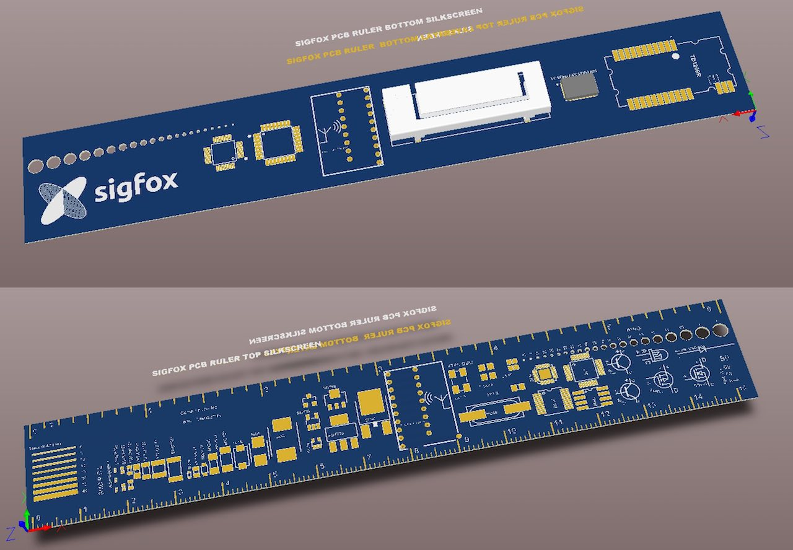

# PCB Ruler with Sigfox components

This design is an port of [Adafruit's PCB ruler](Designed by Frank Zhao for Adafruit Industries) to Altium Designer - also compatible with Circuit Maker and Circuit Studio.

For this version we also replaced some lesser used footprints with others useful for Sigfox design, namely:

* 868Mhz PCB antenna from [Texas Instruments Design Note 38](http://www.ti.com/lit/an/swra416/swra416.pdf)
* [TD-Next TD1208R Sigfox module](http://rfmodules.td-next.com/modules/td1208r/)
  also suitable for the US version, the [TD1508](http://rfmodules.td-next.com/modules/td1508/) 
* [OnSemi AX-SF SoC](http://www.onsemi.com/PowerSolutions/product.do?id=AX-SFEU%20MODULES) 
* [ProAnt OnBoard™ SMD 868/915 Antenna](http://www.proant.se/en/catalogue/internal-antennas/--onboard-smd-antenna/onboard-smd-868915-antenna-pid55.htm)  
 
Gerbers suitable for manufacturing and an Altium PCB Library with all the components is also provided.

